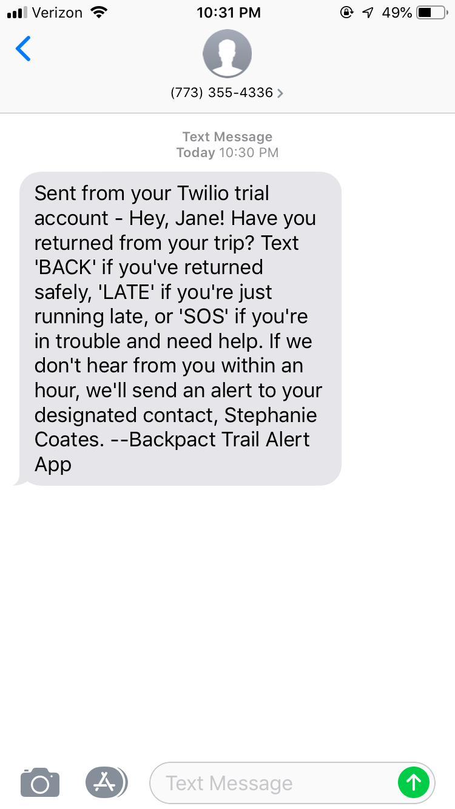
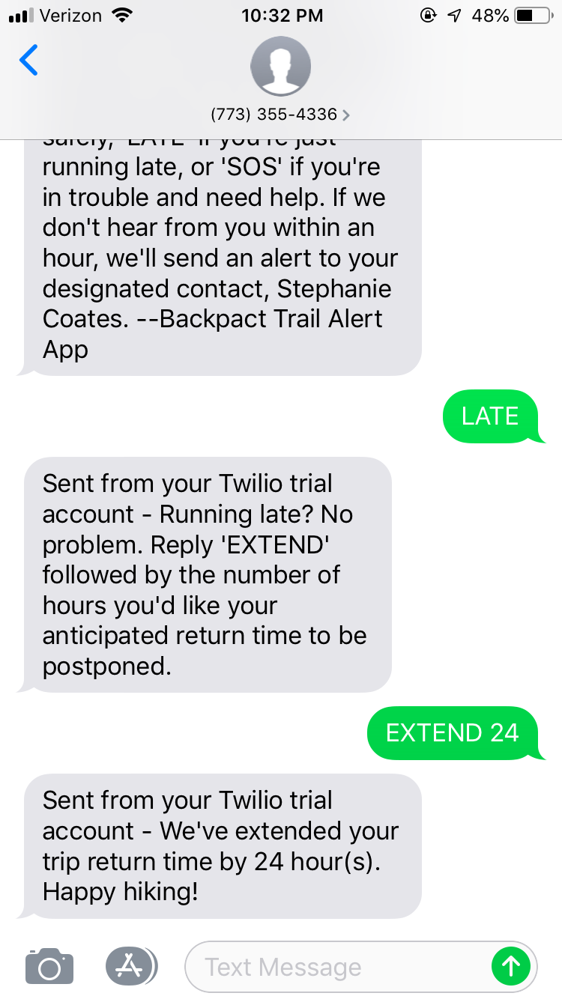
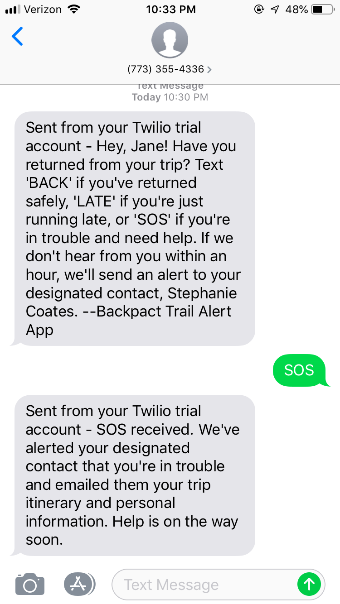
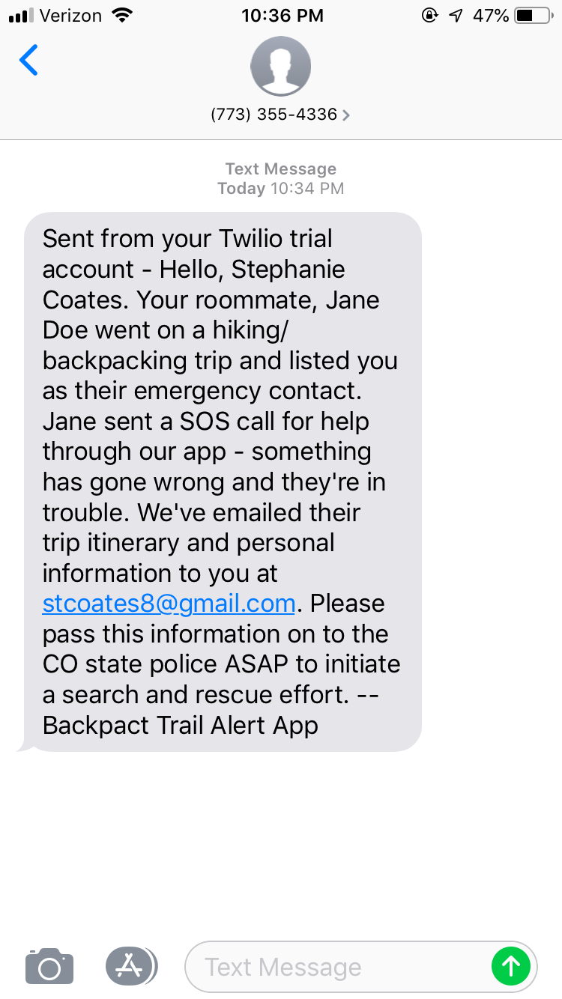
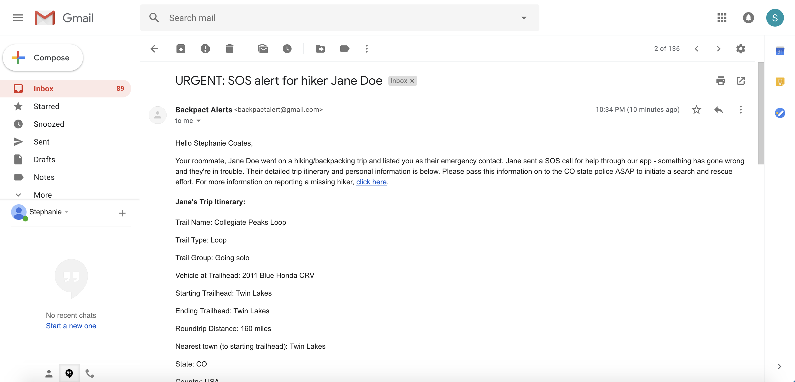
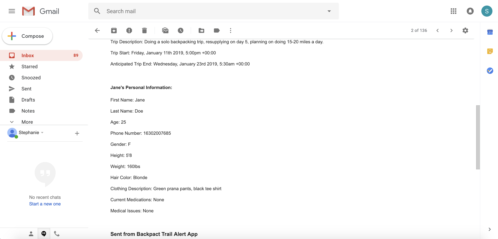

# Backpact

React | Redux | Node | Express | Massive | PostgreSQL | Axios | Bcrypt | Node-Cron | Twilio | TwiML | Nodemailer | Moment.js

Backpact is a responsive trip planning tool & alert system to keep hikers safe in the backcountry. It allows hikers to browse resources, review a trip checklist, set up an alert that will check on them via text to see if they've returned on their expected end date. If the hiker doesn't respond within the hour, Backpact will text and email the hiker's designated contact with the full trip itinerary, along with directions on how to report a missing hiker.

- Won 1st place award for Best Business Solution at Dev Mountain 
- Frontend built in React with Redux
- Backend running on Node.js, using Express as a server and Massive to connect to PostgreSQL database
- Full CRUD / HTTP requests made with Axios
- User authentication using bcrypt
- Moment.js used to parse dates, times, and timezones on frontend and backend
- Styled with material-ui and Styled Components
- Node-cron queries the database every minute, comparing the current timestamp against each hiker's expected end date/time. When an end times expires, functions are fired off to check on the hiker, set an hour countdown, and if no action is taken within the hour, text and email the designated contact
- Twilio used to send texts from the server to hikers and designated contacts
- TwiML used to receive SMS texts from hikers to cancel their alert, extend it, or send an SOS alert to their designated contact immediately
- Email alerts sent to designated contacts via nodemailer

Website: https://backpact.info

**note:** This application used a Twilio trial subscription for sending and receiving SMS texts. The trial subscription has since expired, and the functionality will not work as expected. The hosted version of this web app is for viewing purposes only and should not be relied on as an actual alert system!

